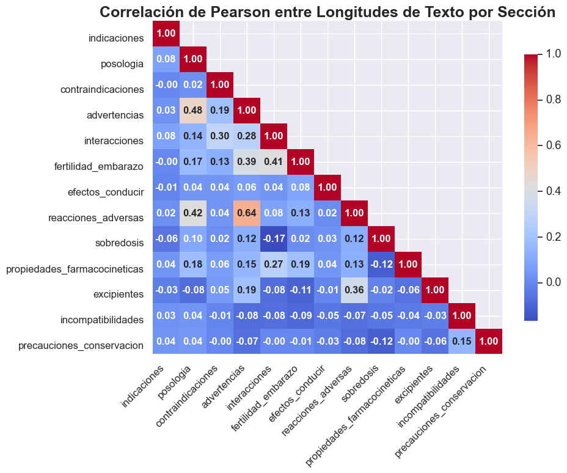
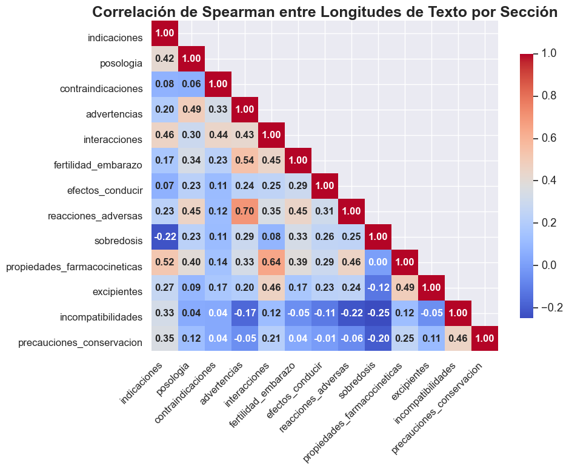
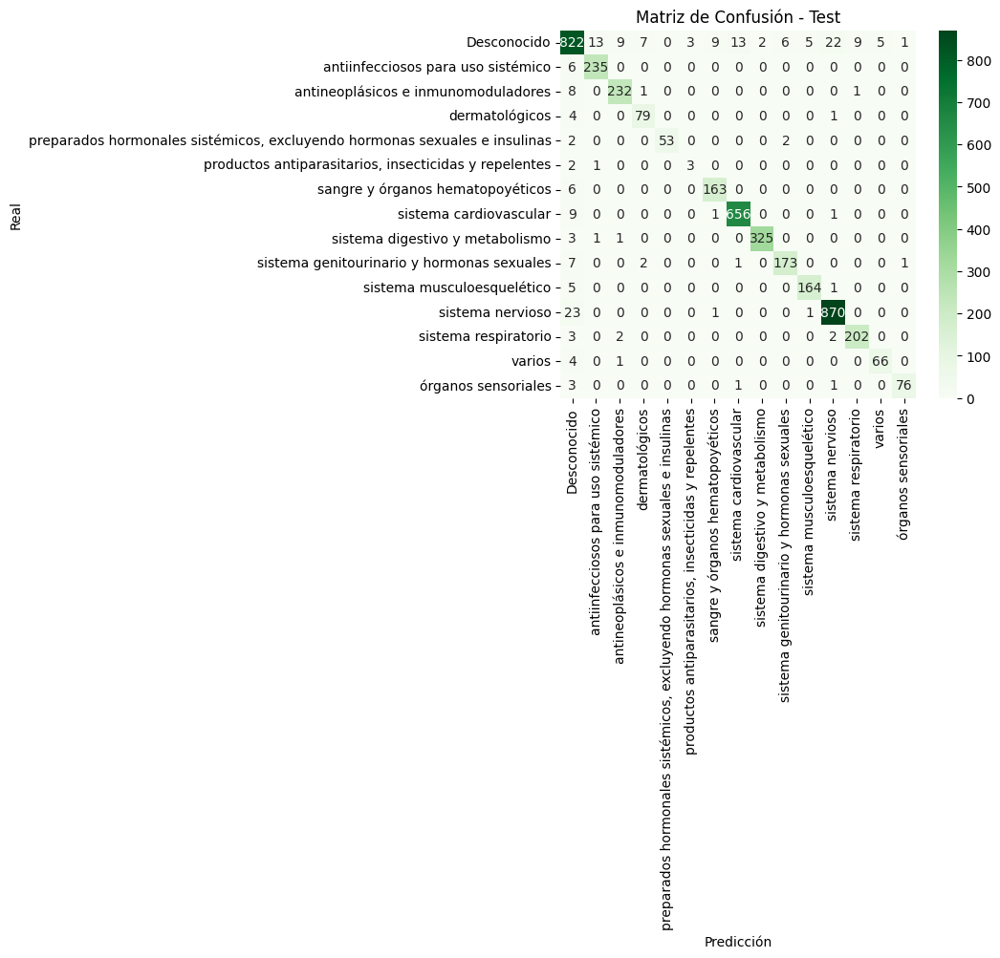
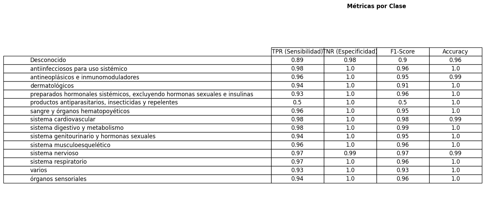
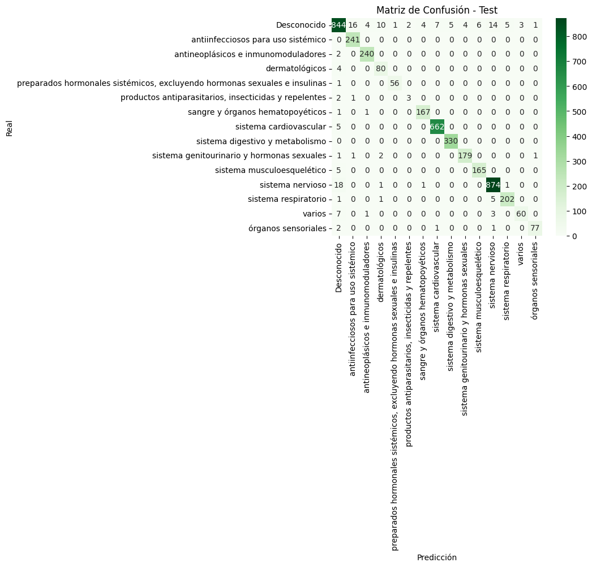
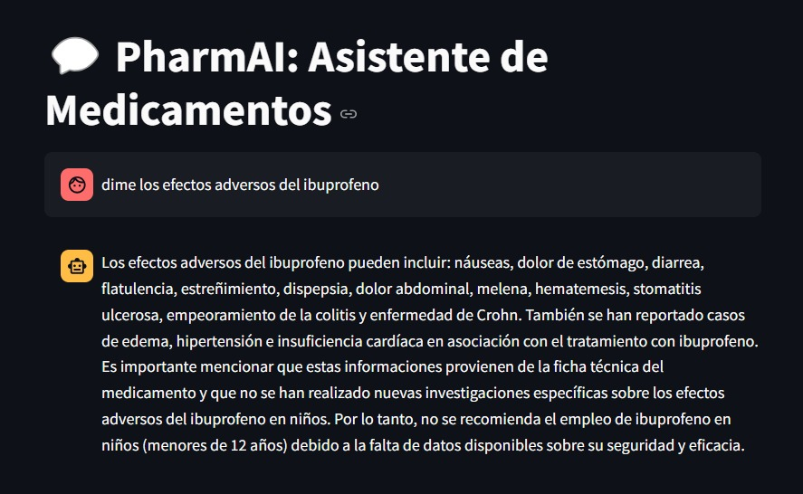

# **PharmAI**

<div align="justify">

**PharmAI** es un proyecto integral de Machine Learning que automatiza la clasificación y análisis de medicamentos utilizando datos de la AEMPS. Desde la extracción de fichas técnicas mediante _web scraping_ hasta la creación de un chatbot especializado, el sistema procesa textos médicos para estructurar información clave (indicaciones, contraindicaciones, etc.), clasifica medicamentos por grupo anatómico-terapéutico (usando códigos ATC) con modelos como _Random Forest_ (97% de precisión), y genera insights mediante análisis exploratorio y visualizaciones. El chatbot, impulsado por _Llama2_ y bases de datos vectoriales, permite consultas contextuales sobre efectos, interacciones y uso de medicamentos, combinando técnicas de NLP y Deep Learning para ofrecer respuestas precisas basadas en evidencia farmacéutica.

</div>

### **Tabla de contenidos**

- [**1. Requisitos**](#1-requisitos) <br>
- [**2. Estructura del proyecto**](#2-estructura-del-proyecto) <br>
  - [**2.1 Adquisición de los datos**](#21-adquisición-de-los-datos)
  - [**2.2 Preprocesamiento de datos**](#22-preprocesamiento-de-datos)
  - [**2.3 Análisis exploratorio de datos (EDA)**](#23-análisis-exploratorio-de-datos-eda)
  - [**2.4 Machine Learning: clasificación de medicamentos**](#24-machine-learning-clasificación-de-medicamentos)
  - [**2.5 Deep Learning: chatbot**](#25-deep-learning-chatbot)
  - [**2.6 Implementación de pipeline completo de audio**](#26-implementación-de-pipeline-completo-de-audio)

## **1. Requisitos**

Para poder ejecutar el proyecto, tenemos que crear un entorno conda con Python 3.11.11 o superior y las siguientes librerías:

```bash
conda create -n pharmAI python=3.11.11
conda activate pharmAI
pip install -r requirements.txt
```

Con esto, ya tenremos todas las dependencias necesarias para ejecutar el proyecto.

## **2. Estructura del proyecto**

Este proyecto es end-to-end y está dividido en varias partes:

### **2.1 Adquisición de los datos**

<div align="justify">

Para la adquisición de los datos, se ha utilizado un scraper que obtiene la información de los medicamentos desde la página web de la [AEMPS (Agencia Española de Medicamentos y Productos Sanitarios)](https://cima.aemps.es/cima/publico/lista.html). El procedimiento es el siguiente:

#### **1. Spider 🕷️**

En esta parte hacemos una consulta a la API de medicamentos de la AEMPS para extraer información de todos los medicamentos autorizados (número de registro, nombre, principios activos y ficha técnica en PDF), procesa los resultados paginados eliminando duplicados y genera un fichero _csv_ con los registros más recientes ordenados por número de registro. Para ejectutar el spider, se utiliza el siguiente comando:

</div>

```bash
python ./src/1_data_acquisition/spider.py
```

Este fichero csv se llama `medicamentos.csv`, guardado en la carpeta `data/outputs/1_data_acquisition/spider` y contiene la siguiente información:

| Columna                | Descripción                                                                   |
| ---------------------- | ----------------------------------------------------------------------------- |
| **nregistro**          | Número de registro oficial del medicamento en la AEMPS (identificador único). |
| **nombre**             | Nombre comercial del medicamento (formato descriptivo).                       |
| **principios_activos** | Sustancias farmacológicamente activas que componen el medicamento.            |
| **pdf_url**            | Enlace directo a la ficha técnica en PDF (cuando está disponible).            |

<br>

#### **2. Fetcher ⬇️​**

<div align="justify">

En esta parte lo que hacemos es leer el fichero `medicamentos.csv` y para cada medicamento, descargamos la ficha técnica en PDF y estos se guardan en la carpeta `data/outputs/1_data_acquisition/fetcher` con el siguiente formato: `Nombre_Medicamento.pdf`. Para ejectutar el spider, se utiliza el siguiente comando:

```bash
python ./src/1_data_acquisition/fetcher.py
```

</div>

> [!NOTE]
> Para ver el contenido que aparece en una ficha técnica haz click [aquí](https://cima.aemps.es/cima/pdfs/ft/99122002/FT_99122002.pdf).

<br>

#### **3. Crawler ⛏️**

<div align="justify">

En esta parte extraemos la información de cada uno de los PDFs descargados en la parte anterior del _fetcher_ y obtenermos ficheros en formato _txt_ para cada uno de los PDFs. Estos ficheros se guardan en la carpeta `data/outputs/1_data_acquisition/crawler` con el siguiente formato: `Nombre_Medicamento.txt`. Para ejectutar el _crawler_, se utiliza el siguiente comando:

```bash
python ./src/1_data_acquisition/crawler.py
```

</div>

<br>

#### **4. Wrangler 📄**

<div align="justify">

En esta parte se procesan los ficheros _txt_ que contienen la información de la ficha técnica de los medicamentos, extrayendo secciones relevantes como indicaciones, posología, contraindicaciones, entre otras. Además se aplican técnicas de limpieza al texto, como la eliminación de caracteres especiales, normalización de espacios y fechas, etc. Al final se organizan todos los datos de los medicamentos en un formato estructurado _json_. Los resultados se guardan en la carpeta `data/outputs/1_data_acquisition/wrangler` y el fichero con el resultado final se llama `medicamentos.json`. Para ejectutar el _wrangler_, se utiliza el siguiente comando:

```bash
python ./src/1_data_acquisition/wrangler.py
```

</div>

> [!NOTE]
> La estructuta que va a tener el _json_ para cada uno de los medicamentos es la siguiente:
>
> ```json
>   "nombre_medicamento_1": {
>         "indicaciones": "...",
>         "posologia": "...",
>         "contraindicaciones": "...",
>         "advertencias": "...",
>         "interacciones": "...",
>         "fertilidad_embarazo": "...",
>         "efectos_conducir": "...",
>         "reacciones_adversas": "...",
>         "sobredosis": "...",
>         "ATC": "...",
>         "Propiedades_farmacocineticas": "...",
>         "excipientes": "...",
>         "incompatibilidades": "...",
>         "precauciones_conservacion": "...",
>         "fecha_revision": "..."
>      }, ...
> ```

<br>
<br>

---

### **2.2 Preprocesamiento de datos**

<div align="justify">

Como hemos visto en la sección anterior, para cada uno de los medicamentos obtenemos una sección llamada _ATC_ que contiene el código _ATC_ del medicamento. Los códigos _ATC_ (_Anatomical Therapeutic Chemical_) son un sistema de clasificación para medicamentos que agrupa fármacos según el órgano o sistema sobre el que actúan, así como sus propiedades terapéuticas, farmacológicas y químicas. Se utilizan para estandarizar la clasificación de los medicamentos a nivel internacional, facilitando la investigación, el análisis de tendencias de prescripción y la farmacovigilancia.

Por ello nos parece importante tener también esta información en el _json_ de salida. Investigando un poco encontramos un repositorio con el cual podemos obtener todos los distintos niveles del código _ATC_ y su descripción ([repositorio de códigos ATC](https://github.com/sarrabenyahia/webscrap_health_monitoring.git)). En este econtramos un fichero _csv_ que contiene la información de los códigos _ATC_ y su descripción. Este fichero lo vamos a guardar en la ruta `data/inputs/2_data_preprocessing/Tabla_ATC.csv`.

El problema que encontramos es que esta información está en inglés. Para obtenerla en español traducimos el fichero manualmente y lo guardamos en la ruta `data/inputs/2_data_preprocessing/Tabla_ATC_traducida.csv`. Este fichero contiene la siguiente información:

| Columna         | Descripción                                                                                                                    |
| --------------- | ------------------------------------------------------------------------------------------------------------------------------ |
| **ATC code_L1** | Código del nivel 1 del sistema. Formato: `X`                                                                                   |
| **name_L1**     | Indica el sistema u órgano principal sobre el que actúan los medicamentos (por ejemplo, "sistema digestivo"). Formato: `X00`   |
| **ATC code_L2** | Código del nivel 2 del sistema ATC                                                                                             |
| **name_L2**     | Describe la subcategoría terapéutica dentro del sistema principal (por ejemplo, "preparados estomatológicos"). Formato: `X00X` |
| **ATC code_L3** | Código del nivel 3 del sistema ATC                                                                                             |
| **name_L3**     | Detalla el subgrupo terapéutico específico (por ejemplo, "preparados para el tratamiento de afecciones bucales").              |
| **ATC code_L4** | Código del nivel 4 del sistema ATC. Formato: `X00XX`                                                                           |
| **name_L4**     | Describe el subgrupo químico o farmacológico (por ejemplo, "agentes profilácticos").                                           |
| **ATC code_L5** | Código del nivel 5 del sistema ATC. Formato: `X00X00`                                                                          |
| **name_L5**     | Indica el principio activo (por ejemplo, "Lorazepam").                                                                         |

Por último, una vez conseguida esta información, la unimos al `medicamentos.json` obtenido en la salida de la parte anterior del wrangler y lo guardamos en la ruta `data/outputs/2_data_preprocessing/fichas_tecnicas_mapped_atc.json`.

</div>

> [!NOTE]
> Finalmente, el fichero _json_ de salida tiene la siguiente estructura:
>
> ```json
>   {
>         "indicaciones": "...",
>         "posologia": "...",
>         "contraindicaciones": "...",
>         "advertencias": "...",
>         "interacciones": "...",
>         "fertilidad_embarazo": "...",
>         "efectos_conducir": "...",
>         "reacciones_adversas": "...",
>         "sobredosis": "...",
>         "ATC": "...",
>         "Propiedades_farmacocineticas": "...",
>         "excipientes": "...",
>         "incompatibilidades": "...",
>         "precauciones_conservacion": "...",
>         "fecha_revision": "...",
>         "nombre_medicamento_completo": "...",
>         "nombre_medicamento": "...",
>         "ATC_Nivel_Anatomico": "...",
>         "Descripcion_Nivel_Anatomico": "...",
>         "ATC_Nivel_2_Subgrupo_Terapeutico": "...",
>         "Descripcion_Nivel_2_Subgrupo_Terapeutico": "...",
>         "ATC_Nivel_3_Subgrupo_Terapeutico_Farmacologico": "...",
>         "Descripcion_Nivel_3_Subgrupo_Terapeutico_Farmacologico": "...",
>         "ATC_Nivel_4_Subgrupo_Terapeutico_Farmacologico_Quimico": "...",
>         "Descripcion_Nivel_4_Subgrupo_Terapeutico_Farmacologico_Quimico": "...",
>         "ATC_Nivel_5_Principio_Activo": "...",
>         "Descripcion_Nivel_5_Principio_Activo": "...",
>    }, ...
> ```

<br>
<br>

---

### **2.3 Análisis exploratorio de datos (_EDA_)**

<div align="justify">

Tras recopilar y organizar la información de los medicamentos, se dispone de un corpus extenso, con aproximadamente 100 millones de palabras. Por otro lado, se realiza un análisis exploratorio con el fin de identificar patrones y extraer conocimiento útil del contenido textual. Esta etapa incluye la creación de distintas visualizaciones, como wordclouds, que ayudan a representar de forma gráfica los términos más relevantes y frecuentes en los textos. A continuación, se muestran algunas de las visualizaciones generadas.

#### **Distribución de medicamentos según el grupo anatómico (nivel 1 código ATC)**


Como observamos, prácticamente la mitad de los medicamentos pertenecen a los grupos anatómicos `sistema nervioso` o `sistema cardiovascular`, mientras que el resto de grupos anatómicos tienen una representación más baja y similar entre ellos.

El grupo anatómico `productos antiparasitarios, insecticidas y repelentes` es, con mucha diferencia, el que menos medicamentos tiene.
Esto quizás nos ponga problemas a la hora de clasificar, ya que el modelo puede no aprender lo suficiente sobre este grupo anatómico.

#### **Wordclouds**


Estas son las palabras que más aparecen en todo el corpus obtenido de las fichas técnicas con más de 100 millones de palabras, aunque se han aplicado la técnica de _stopwords_ (mostradas en el fichero `assets/spanish_stopwords.txt`) donde eliminamos las palabras más comunes usadas en la lengua española, como preposiciones, conjunciones, etc. Como era de esperar, la mayoría de palabras que aparecen se pueden asociar al campo médico y farmacéutico, como por ejemplo: `riesgo`, `mg` (de dosis), `insuficiencia renal`, etc.

A continuación se muestran algunos wordclouds obtenidos para los distintos grupos anatómicos (nivel 1 código _ATC_):

<details>
  <summary>Antiinfecciosos para uso sistémico</summary>
  
</details>

<details>
  <summary>Antineoplásicos e inmunomoduladores</summary>
  
</details>

<details>
  <summary>Dermatológicos</summary>
   
</details>

<details>
  <summary>Órganos sensoriales</summary>
   
</details>

<details>
  <summary>Preparados hormonales sistémicos excluyendo hormonas sexuales e insulinas</summary>
   
</details>

<details>
  <summary>Productos antiparasitarios, insecticidas y repelentes</summary>
   
</details>

<details>
  <summary>Sangre y órganos hematopoyéticos</summary>
   
</details>

<details>
  <summary>Sistema cardiovascular</summary>
   
</details>

<details>
  <summary>Sistema digestivo y metabolismo</summary>
   
</details>

<details>
  <summary>Sistema genitourinario y hormonas sexuales</summary>
   
</details>

<details>
  <summary>Sistema musculoesquelético</summary>
   
</details>

<details>
  <summary>Sistema nervioso</summary>
   
</details>

<details>
  <summary>Varios</summary>
   
</details>

#### **Ranking de palabras según _TF-IDF_ y _Bag of Words_**


Este diagrama compara los 15 términos más relevantes según dos métodos de vectorización: _Bag of Words_ (_BoW_) y _TF-IDF_.

- <u>_Bag of Words (BoW)_</u>: representa la cantidad de veces que aparece cada palabra en el corpus, sin tener en cuenta su orden o contexto. En la gráfica se muestra en el eje horizontal inferior y las barras de color salmón. Agunas palabras que destacan para esta técnica son: `ensayos`, `estudio`, `peso`, `combinación`, etc. Vemos que son palabras que tienen sentido que aparezcan con mayor frecuencia en el campo de los medicamentos.

- <u>_TF-IDF_</u>: calcula la frecuencia de una palabra en un documento y la pondera inversamente según su frecuencia en todo el corpus, resaltando términos más informativos y penalizando los comunes. En la gráfica se muestra en el eje horizontal superior y las barras de color azul. Agunas palabras que destacan para esta técnica son: `hidroclorotiazida`, `ácido`, `atorvastatina`, etc. Vemos que son palabras más técnicas y específicas para cada medicamento.

Además, vemos que hay palabras que destacan en ambas técnicas, lo cual quiere decir que son las palabras más importantes en el ámbito médico y farmacéutico. Por ejemplo: `cyp`, `kg`, `inhibidores`, `exposición`, etc. Estas palabras son relevantes tanto en términos de frecuencia absoluta como en su peso relativo al corpus.

</div>

> [!TIP]
> La palabra `cyp` es la más relevante en ambas técnicas. Esta se refiere a las enzimas del citocromo P450, que son esenciales para el metabolismo de muchos medicamentos. Estas enzimas intervienen en la biotransformación de fármacos, influyendo en su eficacia, seguridad y posibles interacciones. Por ello, es normal aparezca con alta frecuencia en textos relacionados con medicamentos en ambas técnicas de vectorización.

#### **Correlación de Pearson entre las longitudes de los textos por sección**



<div align="justify">

Este _heatmap_ muestra la correlación entre las longitudes de los textos de diferentes secciones de las fichas técnicas de los medicamentos, es decir, medimos la relación lineal entre las longitudes de los textos de dos secciones. En nuestro caso, como hemos definido en el fichero _json_ de salida, tenemos las siguientes secciones: `indicaciones`, `posología`, `contraindicaciones`, `advertencias`, `interacciones`, `fertilidad_embarazo`, `efectos_conducir`, `reacciones_adversas`, `sobredosis`, `Propiedades_farmacocineticas`, `excipientes`, `incompatibilidades` y `precauciones_conservacion`.

La correlación se calcula utilizando el coeficiente de correlación de _Pearson_, que varía entre -1 y 1. Un valor cercano a 1 indica una alta correlación positiva, mientras que un valor cercano a -1 indica una alta correlación negativa. Un valor cercano a 0 indica poca o ninguna correlación. Este coeficiente es sensible a valores atípicos, por lo que la existencia de medicamentos con textos extraordinariamente largos o cortos puede influir en el resultado.

Como podemos ver tenemos alta correlación lineal entre la extensión del texto de `advertencias`y `reacciones_adversas` $(0.71)$, así como con `posología` $(0.60)$. Tiene sentido ya que estos campos suelen incluir información sobre efectos secundarios y advertencias de uso. También podemos ver media correlación entre `propiedades_farmacocineticas` y campos como `interacciones` $(0.46)$. Esto se debe a que el campo `propiedades_farmacocineticas` incluye información sobre cómo se absorbe, distribuye y elimina el medicamento del organismo, lo que puede influir en las interacciones con otros medicamentos.

#### **Correlación de Spearman entre las longitudes de los textos por sección**



Ahora mostramos la correlación entre las longitudes de los textos de las diferentes secciones utilizando el coeficiente de correlación de _Spearman_. A diferencia de _Pearson_, _Spearman_ mide la relación monótona entre variables basándose en los rangos de los valores, en lugar de sus valores absolutos. Esto hace que los _outliers_ tengan menos impacto en el resultado. Por lo tanto, es más robusto ante la presencia de valores atípicos.

Es decir, la correlación de Spearman nos permite confirmar si, independientemente de la magnitud exacta de las longitudes, dos secciones tienden a aumentar o disminuir juntas. Como vemos, ahora tenemos correlaciones más altas entre las longitudes de los textos de las secciones dado que estamos omitiendo ese "ruido" que nos aportan los _outliers_. Por ejemplo, vemos que ahora tenemos una correlación de $0.61$ entre `interacciones` y `advertencias`, así como una correlación de $0.60$ entre `fertilidad_embarazo` y `advertencias`, mientras que antes, con la correlación de _Pearson_, teníamos una correlación de $0.39$ y $0.46$ respectivamente.

---

### **2.4 Machine Learning: clasificación de medicamentos**

En esta sección se han desarrollado dos modelos de clasificación para predecir la descripción del nivel anatómico de los medicamentos a partir de sus fichas técnicas. Se ha empleado una regresión logística y un modelo de _Random Forest_ para abordar el problema. Para ambos modelos se han empleado la matriz _TF-IDF_ conseguida en el apartado anterior para conseguir resultados óptimos al clasificar los medicamentos con un porcentaje de entrenamiento del $80\%$ y un porcentaje de test del $20\%$.

#### **Regresión logística**

Los resultados obtenidos para la regresión logística son los siguientes:

- **Train accuracy**: $0.99$
- **Test accuracy**: $0.95$

A continuación se muestra la matriz de confusión obtenida para el modelo:



Y por último mostramos alguna métrica de evaluación del modelo para cada una de las clases:



En general, para el modelo de regresión logística, podemos decir que tiene una buena _performance_ y es capaz de clasificar correctamente la mayoría de los medicamentos, aunque se puede apreciar una ligera diferencia en el _accuracy_ entre el conjunto de entrenamiento y el de test, lo que indica que el modelo puede estar ligeramente sobreajustado. Pero en genera vemos que el modelo es capaz de clasificar correctamente la mayoría de los medicamentos, aunque hay algunas clases que tienen un _F1-score_ más bajo, como por ejemplo `productos antiparasitarios, insecticidas y repelentes`, lo cual es normal ya que es la clase con menos datos.

#### **_Random Forest_**

Los resultados obtenidos para _Random Forest_ son los siguientes:

- **Train accuracy**: $1.00$
- **Test accuracy**: $0.97$

A continuación se muestra la matriz de confusión obtenida para el modelo:



Y por último mostramos alguna métrica de evaluación del modelo para cada una de las clases:


Como en el modelo anterior, obtenemos muy buenos valores de _accuracy_ tanto en el _train_ como en el _test_, pero ahora los conseguimos mejorar teniendo un valor de $1.0$ y $0.97$ respectivamente. Esto indica que el modelo de _Random Forest_ es capaz de clasificar mejor algunos modelos que la regresión logística no podía clasificar correctamente. Aunque de nuevo vemos que la clase `productos antiparasitarios, insecticidas y repelentes` tiene un _F1-score_ bajo. Por lo tanto, para poder conseguir aumentar este valor sería conveniente hacer un _undersampling_ de las clases que tienen más datos o un _over sampling_ de la clase que tiene menos datos, pero esto lo dejamos como trabajo futuro.

#### _Feature Importance_

En esta sección vamos a mostrar la importancia de las características para el modelo de regresión logística que hemos entrenado. La importancia de las características nos indica qué palabras son más relevantes para la clasificación de los medicamentos según cada clase. A continuación se muestra una tabla con las palabras más relevantes en orden descendente para cada clase:

| clase                   | 0                                                                                                                       | 1                                                                                                                                                                                     | 2                                                                                                                                                                                    | 3                                                                                                                 | 4                                                                                                                                             | 5                                                                                                                                | 6                                                                                                                                                    | 7                                                                                                                                                                                            | 8                                                                                                                                                                                            | 9                                                                                                                                                                                      | 10                                                                                                                                                                                                   | 11                                                                                                                                                                                                                                         | 12                                                                                                                                                    | 13                                                                                                                       | 14                                                                                                                             |
| ----------------------- | ----------------------------------------------------------------------------------------------------------------------- | ------------------------------------------------------------------------------------------------------------------------------------------------------------------------------------- | ------------------------------------------------------------------------------------------------------------------------------------------------------------------------------------ | ----------------------------------------------------------------------------------------------------------------- | --------------------------------------------------------------------------------------------------------------------------------------------- | -------------------------------------------------------------------------------------------------------------------------------- | ---------------------------------------------------------------------------------------------------------------------------------------------------- | -------------------------------------------------------------------------------------------------------------------------------------------------------------------------------------------- | -------------------------------------------------------------------------------------------------------------------------------------------------------------------------------------------- | -------------------------------------------------------------------------------------------------------------------------------------------------------------------------------------- | ---------------------------------------------------------------------------------------------------------------------------------------------------------------------------------------------------- | ------------------------------------------------------------------------------------------------------------------------------------------------------------------------------------------------------------------------------------------ | ----------------------------------------------------------------------------------------------------------------------------------------------------- | ------------------------------------------------------------------------------------------------------------------------ | ------------------------------------------------------------------------------------------------------------------------------ |
| **nombre**              | desconocido                                                                                                             | antiinfecciosos para uso sistémico                                                                                                                                                    | antineoplásicos e inmunomoduladores                                                                                                                                                  | dermatológicos                                                                                                    | preparados hormonales sistémicos, excluyendo hormonas sexuales e insulinas                                                                    | productos antiparasitarios, insecticidas y repelentes                                                                            | sangre y órganos hematopoyéticos                                                                                                                     | sistema cardiovascular                                                                                                                                                                       | sistema digestivo y metabolismo                                                                                                                                                              | sistema genitourinario y hormonas sexuales                                                                                                                                             | sistema musculoesquelético                                                                                                                                                                           | sistema nervioso                                                                                                                                                                                                                           | sistema respiratorio                                                                                                                                  | varios                                                                                                                   | órganos sensoriales                                                                                                            |
| **palabras<br> claves** | social<br>er<br>basal<br>mg mg<br>dutasterida tamsulosina<br>función renal<br>eu<br>producir<br>mg etoricoxib<br>código | sistémico antibacterianos<br>antibacterianos<br>sistémico<br>antiinfecciosos sistémico<br>antiinfecciosos<br>ceftriaxona<br>ribavirina<br>macrólidos<br>lactámicos<br>beta lactámicos | antineoplásicos<br>antineoplásicos inmunomoduladores<br>inmunomoduladores<br>inmunosupresores<br>lmc<br>anastrozol<br>pirfenidona<br>pomalidomida<br>abiraterona<br>mielodisplásicos | preparados<br>tópico<br>isotretinoína<br>contacto<br>quemaduras<br>ac<br>tinea<br>antifúngicos<br>acné<br>cutáneo | hormonas<br>calcio sérico<br>paricalcitol<br>octreotida<br>insulinas<br>levotiroxina<br>hormonas sexuales<br>excluyendo<br>hormonales<br>yodo | hidroxicloroquina<br>pentamidina<br>crema<br>kg<br>clopidogrel<br>isquémico<br>hidrocloruro<br>profilaxis<br>metronidazol<br>ait | hematopoyéticos<br>agentes antitrombóticos<br>antitrombóticos<br>soluciones<br>sanguíneos<br>sustitutos<br>órganos<br>sangre<br>hierro<br>rivaroxabá | sistema cardiovascula<br>cardiovascular<br>simples<br>cardiovascular agentes<br>modificadores lípidos<br>agentes modificadores<br>modificadores<br>agentes<br>bloqueadores<br>agentes actúan | digestivo metabolismo<br>sistema digestivo<br>digestivo<br>metabolismo medicamentos<br>medicamentos hipoglucemiantes<br>darunavir<br>mesalazina<br>insulinas<br>vildagliptina<br>ondansetrón | hormonas sexuales<br>urológicos<br>genitourinario<br>sexuales<br>hormonas<br>progestágenos<br>vaginal<br>ape<br>tadalafilo mg<br>\_mg_comprimidos_recubiertos_con_pelicula_efg sistema | antiinflamatorios antirreumáticos<br>antirreumáticos<br>productos antiinflamatorios<br>musculoesquelético<br>productos<br>antiinflamatorios<br>bisfosfonatos<br>baclofeno<br>febuxostat<br>celecoxib | analgésicos<br>nervioso analgésicos<br>psicoanalepticos<br>nervioso psicoanalepticos<br>psicolepticos<br>nervioso psicolepticos<br>antiepilépticos <br>\_mg_comprimidos_recubiertos_con_pelicula_efg sistema<br>antipsicóticos<br>opioides | sistema respiratorio<br>respiratorio<br>preparados<br>tos<br>antihistamínicos<br>montelukast<br>nasal<br>respiratorias<br>ebastina<br>órganos término | terapéuticos<br>prueba<br>sugammadex<br>deferasirox<br>contraste<br>oxígeno<br>mbq<br>cálcico<br>sevelámero<br>productos | sensoriales<br>ojo<br>oftálmica<br>lisdexanfetamina<br>colirio<br>timolol<br>corneal<br>bimatoprost<br>gotas<br>microgramos kg |

En cambio, para el modelo de _Random Forest_ no es posible obtener la palabras claves para cada clase, si no que podemos obtener un ranking de las palabras que son más relevantes para la clasificación de los medicamentos: `digestivo metabolismo`, `antineoplásicos inmunomoduladores`,`sistema digestivo`, `sistema cardiovascular`, `antiinfecciosos sistémico`, `sistema respiratorio`, `inmunomoduladores`, `antiinfecciosos`, `cardiovascular agentes`, `genitourinario`.

#### **Predicción de nivel anatómico**

En la última parte del notebook, tras haber ejecutado todas la celdas anteriores, tenemos un ejercicio donde podemos elegir cualquier medicamento de los 20.000 que hay y hacer una predicción de la clase del nivel anatómico al que pertenece.

El procedimiento es el siguiente: solicitamos al usuario que introduzca el índice de un medicamento. Despues, se extrae el texto completo del medicamento, y por ende, de la ficha técnica del medicamento seleccionado (columna `texto_completo`) y se transforma a su representación numérica mediante el vectorizador TF-IDF previamente entrenado. Esto convierte el texto en un vector que los modelos pueden procesar. Y por último, se predice la probabilidad de pertenecer a cada clase.

---

### **2.5 Deep Learning: chatbot**

Por último, hemos intentado recrear un chatbot que pueda responder a preguntas sobre los medicamentos. Para ello hemos realizado el siguiente procedimiento.

Primero debemos reestructurar el fichero _json_ para facilitar la búsqueda de información en la base de datos vectorial que generaremos después. Ahora en vez de tener un diccionario para cada medicamento con todas las secciones correspondientes, tenemos un diccionario para cada sección de cada medicamento.

</div>

> [!NOTE]
> Ahora la estructura del _json_ es la siguiente:
>
> ```python
> [
>    {
>        "medicamento": "Paracetamol",
>        "nombre_completo_medicamento": "PARACETAMOL_NORMON_500_mg _OMPRIMIDOS_EFG",
>        "categoria": "indicaciones",
>        "texto": "en base a su efecto antiagregante plaquetario está indicado en..."
>     },
>     {
>         "medicamento": "Ibuprofeno",
>         "nombre_completo_medicamento": "IBUPROFENO_WINADOL_600_mg_COMPRIMIDOS_RECUBIERTOS_CON_PELICULA_EFG",
>         "categoria": "advertencias",
>         "texto": "Dado el efecto antiagregante plaquetario del ibuprofeno..."
>    },
>     ...
> ]
> ```

<div align="justify">

Continuaremos generando _embeddings_ para cada uno de los textos de las secciones de los medicamentos. Para ello utilizamos el modelo `all-MiniLM-L6-v2` de _Sentence Transformers_. Estos capturan la semántica del texto permitiendo realizar búsquedas por significado en lugar de solo coincidencias de palabras. Esto es útil para responder preguntas complejas o encontrar información relacionada en el corpus de medicamentos.

Según esto, el _embedding_ de cada texto es un vector de 384 dimensiones. En nuestro caso tenemos un tamaño de: $(289708, 384)$. Esto quiere decir que tenemos 289.708 textos y cada uno de ellos tiene un vector de 384 dimensiones. Por lo tanto, tenemos más de 111 millones de números que representan el corpus de medicamentos. Todo esto lo guardamos en la ruta `../../data/outputs/5_chatbot/embeddings_all-MiniLM-L6-v2.npy`.

Seguiremos almacenando estos _embeddings_ en una base de datos vectorial _`FAISS`_ usando _`IndexFlatL2`_ . Un índice en _`FAISS`_ es una estructura optimizada para almacenar y buscar embeddings. _`IndexFlatL2`_ es un tipo de índice simple que usa distancia Euclidiana (_L2_) para comparar vectores. La distancia _L2_ (Euclidiana) entre dos vectores es la raíz cuadrada de la suma de las diferencias al cuadrado entre sus componentes.

$$
d(\mathbf{x}, \mathbf{y}) = \sqrt{\sum_{i=1}^{n} (x_i - y_i)^2}
$$

Esta se usa para medir la similitud entre dos vectores. Cuanto más cerca estén los vectores, menor será la distancia. Por lo tanto, se usa para medir la similitud: menor distancia = mayor similitud.

Después, tenemos que realizar el siguiente procedimiento para conseguir hacer búsquedas en la base de datos vectorial. Los pasos son los siguientes:

1. Cargamos el índice _`FAISS`_ desde el archivo guardado.
2. Cargamos los fragmentos de texto originales para poder recuperar la información relevante.
3. Convertimos la consulta en un embedding usando el mismo modelo `all-MiniLM-L6-v2`.
4. Buscamos los embeddings más cercanos en _`FAISS`_ usando la distancia _L2_.
5. Recuperamos los fragmentos de texto asociados a los embeddings más cercanos.
6. Devolvemos los fragmentos más relevantes como resultados.

Después de realizar este procedimiento, lo que tenemos es el 'contexto' de la pregunta que nos ha hecho el usuario y así poder responder a la pregunta de manera más precisa. El 'contexto' estará formado por los 10 fragmentos más parecidos a la _query_ de la consulta, es decir, la menor distancia entre los embeddings encontrados con el embedding de la _query_.

Finalmente, lo que hacemos es pasar a un modelo de lenguaje preentrenado, en este caso el modelo `LLama2 Chat 7b` de _Meta_, el contexto que hemos obtenido y la pregunta del usuario. Este modelo es capaz de generar respuestas coherentes y relevantes basadas en el contexto proporcionado. Por lo tanto, el modelo generará una respuesta a la pregunta del usuario utilizando el contexto que le hemos proporcionado. A continuación se muestra un ejemplo de pregunta y respuesta generada por el modelo:



A continuación se muestran los pasos para poder ejecutar el chatbot en local:

Primero tenemos que acceder al siguiente
[enlace](https://huggingface.co/meta-llama/Llama-2-7b-chat-hf) de _HuggingFace_ dandonos de alta en caso de no tener una cuenta creada.

A continuación tenemos que aceptar los términos y condiciones del modelo y rellanar el modelo que aparece abajo de `LLAMA 2 COMMUNITY LICENSE AGREEMENT`.

Tendremos que esperar a que nos acepten la solicitud (no suelen tardar mucho) y después de esto tendremos que irnos a la sección de `Access Tokens` para generar un token de acceso. Este token es necesario para poder acceder al modelo y ejecutarlo en local.

```bash
huggingface-cli login
```

Después entraremos a una _shell_ de _Huggingface_ donde deberemos importar el token de acceso que hemos generado anteriormente. Por último ejecutaremos el siguiente código de _streamlit_ para poder interactuar con el chatbot:

```
streamlit run app.py
```

</div>

> [!WARNING]
> La consulta puede durar bastante tiempo, en torno a **15-20 minutos** dependiendo de los recursos de tu ordenador

---

**2.6 Implementación de pipeline completo de audio**

<div align="justify">

En esta sección presentamos un flujo _end-to-end_ para convertir las grabaciones en vectores numéricos aptos para entrenamiento. Primero aseguramos una **limpieza y normalización** homogénea de todas las señales; después extraemos un conjunto de **features acústicas** que capturan información espectral y temporal relevante. Finalmente, utilizaremos estas representaciones para entrenar un clasificador binario que distinga entre audios de **“efectos adversos”** y **“otros”**.

---

#### **2.6.1 Preprocesado del audio**

Antes de la extracción de features, cada fichero de audio pasa por las siguientes etapas. Vamos a mostrar el proceso que sufre un audio mostrando su _waveform_ y su espectrograma para ver cómo cambia la señal a lo largo del proceso. A continuación se muestra un ejemplo de un audio que hemos preprocesado:

[▶️ Escuchar “Audio 9 – efectos adversos”](audio/data/outputs/6_audios/efectos_adversos/audio_9_angel.wav)

1. **Carga y resampleado**  
   Se convierte a mono y se ajusta a una tasa de muestreo fija (por ejemplo, 16 kHz) para asegurar uniformidad.

2. **Reducción de ruido y recorte de silencio**  
   Eliminamos componentes de baja energía y ruido de fondo mediante técnicas de _spectral gating_ y recorte de segmentos silenciosos con un umbral en dB.

3. **Pre-énfasis**  
   Se aplica un filtro FIR que realza las frecuencias altas para mejorar la detección de formantes vocales.

4. **Filtrado pasa-banda**  
   Se conserva únicamente la banda vocal (300–3400 Hz) usando un filtro Butterworth de cuarto orden.

5. **Normalización RMS**  
   Ajustamos el nivel de energía de la señal para que todas las muestras tengan la misma potencia (por ejemplo, RMS = 0.1).

</div>

> [!NOTE]
> Este pipeline está encapsulado en una única función del módulo `utils_audio.py`, lo que permite su uso directo sobre cualquier archivo `.wav`

#### **2.6.2 Extracción de features acústicas**

<div align="justify">

Con la señal ya preprocesada (`y`, `sr`), extraemos un conjunto de descriptores que capturan distintos aspectos de la información espectral y temporal:

- **MFCC (Mel-Frequency Cepstral Coefficients)**  
  Representan la envolvente espectral en una escala mel, muy útiles para modelar la percepción humana del sonido.

- **Chroma STFT**  
  Indica la intensidad de cada semitono (12 bins) a lo largo del tiempo, capturando la huella armónica.

- **Spectral Contrast**  
  Mide la diferencia entre picos y valles en distintas bandas de frecuencia, resaltando componentes resonantes.

- **Tonnetz**  
  Un mapa tonal que representa relaciones armónicas basadas en la transformada de Chakrabarti.

- **Zero-Crossing Rate (ZCR)**  
  Tasa de cambios de signo de la onda, asociada a la “aspereza” o ruido de la señal.

- **Spectral Centroid & Roll-off**  
  Indicadores de brillo y ancho de banda activo de la señal.

</div>

> [!NOTE]
> Al igual que el preprocesado, la extracción de features se encapsula en una función del módulo `utils_audio.py`, lo que permite su uso directo sobre cualquier archivo `.wav`
