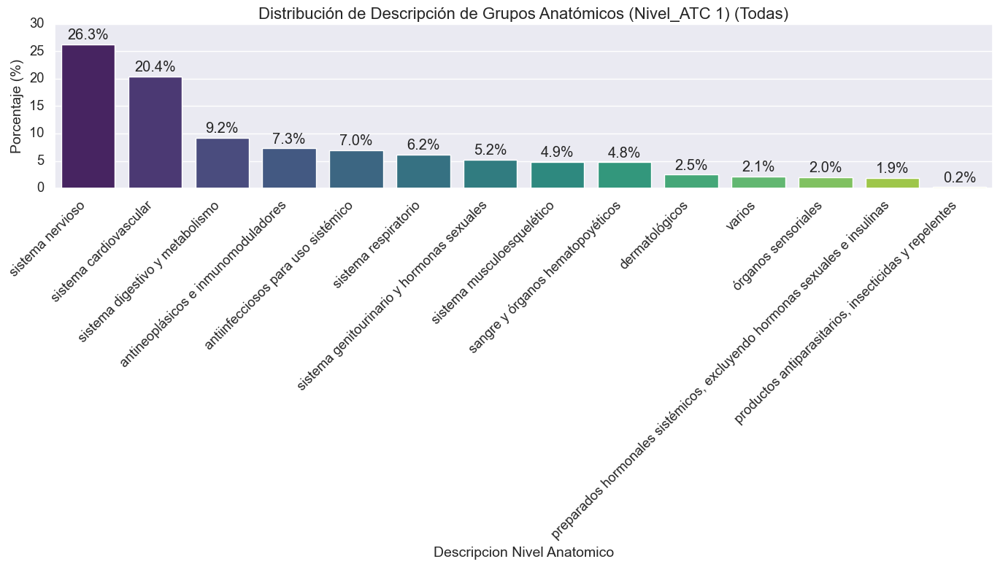
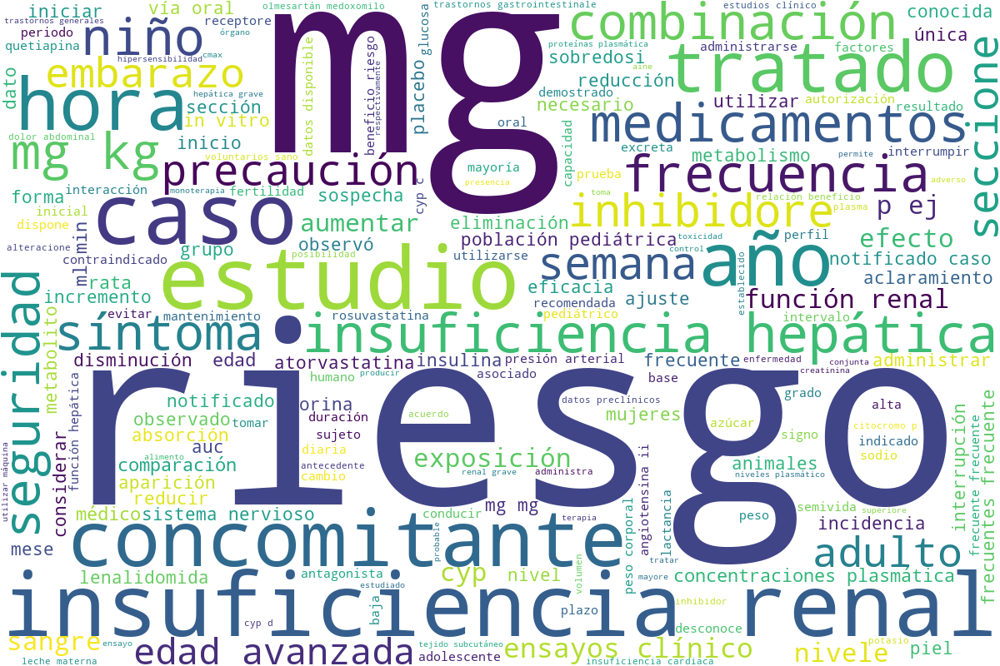
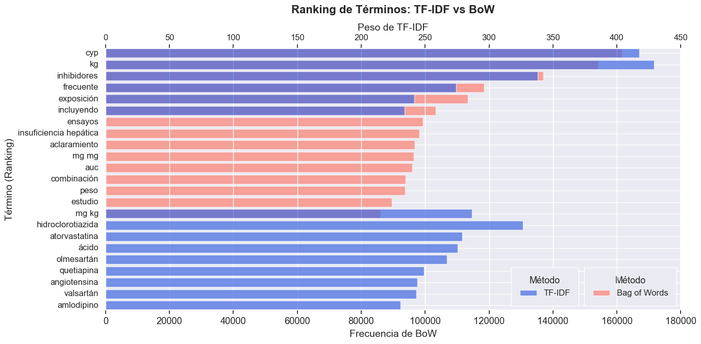

# **PharmAI**

### **Tabla de contenidos**

- [**1. Requisitos**](#1-requisitos) <br>
- [**2. Estructura del proyecto**](#2-estructura-del-proyecto) <br>
   - [**2.1 Adquisición de los datos**](#21-adquisición-de-los-datos)
   - [**2.2 Preprocesamiento de datos**](#22-preprocesamiento-de-datos)
   - [**2.3 Análisis exploratorio de datos (EDA)**](#23-análisis-exploratorio-de-datos-eda)


## **1. Requisitos**
Para poder ejecutar el proyecto, es necesario tener instalado Python 3.11.11 o superior y las siguientes librerías:

```bash
pip install -r requirements.txt
```
Con esto, ya tenremos todas las dependencias necesarias para ejecutar el proyecto.

## **2. Estructura del proyecto**

Este proyecto es end-to-end y está dividido en varias partes:

### **2.1 Adquisición de los datos**

Para la adquisición de los datos, se ha utilizado un scraper que obtiene la información de los medicamentos desde la página web de la [AEMPS (Agencia Española de Medicamentos y Productos Sanitarios)](https://cima.aemps.es/cima/publico/lista.html). El procedimiento es el siguiente:

#### **1. Spider 🕷️**

En esta parte hacemos una consulta a la API de medicamentos de la AEMPS para extraer información de todos los medicamentos autorizados (número de registro, nombre, principios activos y ficha técnica en PDF), procesa los resultados paginados eliminando duplicados y genera un fichero _csv_ con los registros más recientes ordenados por número de registro. Para ejectutar el spider, se utiliza el siguiente comando:

```bash
python blablabla.py
```

Este fichero csv se llama `medicamentos.csv`, guardado en la carpeta `data/outputs/1_data_acquisition/spider` y contiene la siguiente información:

   | Columna              | Descripción                                                                 |
|----------------------|-----------------------------------------------------------------------------|
| **nregistro**        | Número de registro oficial del medicamento en la AEMPS (identificador único). |
| **nombre**           | Nombre comercial del medicamento (formato descriptivo).                     |
| **principios_activos** | Sustancias farmacológicamente activas que componen el medicamento.         |
| **pdf_url**          | Enlace directo a la ficha técnica en PDF (cuando está disponible).          |

<br>

#### **2. Fetcher ⬇️​**

En esta parte lo que hacemos es leer el fichero `medicamentos.csv` y para cada medicamento, descargamos la ficha técnica en PDF y estos se guardan en la carpeta `data/outputs/1_data_acquisition/fetcher` con el siguiente formato: `Nombre_Medicamento.pdf`.  Para ejectutar el spider, se utiliza el siguiente comando:

```bash
python blablabla.py
```

> [!NOTE] 
> Para ver el contenido que aparece en una ficha técnica haz click [aquí](https://cima.aemps.es/cima/pdfs/ft/99122002/FT_99122002.pdf).

#### **3. Crawler ⛏️**

En esta parte extraemos la información de cada uno de los PDFs descargados en la parte anterior del _fetcher_ y obtenermos ficheros en formato _txt_ para cada uno de los PDFs. Estos ficheros se guardan en la carpeta `data/outputs/1_data_acquisition/crawler` con el siguiente formato: `Nombre_Medicamento.txt`.  Para ejectutar el _crawler_, se utiliza el siguiente comando:

```bash
python blablabla.py
```


#### **4. Wrangler 📄**

En esta parte se procesan los ficehros _txt_ que contienen la información de la ficha técnica de los medicamentos, extrayendo secciones relevantes como indicaciones, posología, contraindicaciones, entre otras. Además se aplican técnicas de limpieza al texto, como la eliminación de caracteres especiales, normalización de espacios y fechas, ... Al final se organizan todos los datos de los medicamentos en un formato estructurado _json_. Los resultados se guardan en la carpeta `data/outputs/1_data_acquisition/wrangler` y el fichero con el resultado final se llama `medicamentos.json`. Para ejectutar el _wrangler_, se utiliza el siguiente comando:

```bash
python blablabla.py
```

> [!NOTE]
> La estrucuta que va a tener el _json_ para cada uno de los medicamentos es la siguiente:
> ```json
>   "nombre_medicamento_1": {
>         "indicaciones": "...",
>         "posologia": "...",
>         "contraindicaciones": "...",
>         "advertencias": "...",
>         "interacciones": "...",
>         "fertilidad_embarazo": "...",
>         "efectos_conducir": "...",
>         "reacciones_adversas": "...",
>         "sobredosis": "...",
>         "ATC": "...",
>         "Propiedades_farmacocineticas": "...",
>         "excipientes": "...",
>         "incompatibilidades": "...",
>        "precauciones_conservacion": "...",
>         "fecha_revision": "..."
>      }, ...
>   ```

<br>
<br>

### **2.2 Preprocesamiento de datos**
Como hemos visto en la sección anterior, para cada uno de los medicamentos obtenemos una sección llamada _ATC_ que contiene el código _ATC_ del medicamento. Los códigos _ATC_ (_Anatomical Therapeutic Chemical_) son un sistema de clasificación para medicamentos que agrupa fármacos según el órgano o sistema sobre el que actúan, así como sus propiedades terapéuticas, farmacológicas y químicas. Se utilizan para estandarizar la clasificación de los medicamentos a nivel internacional, facilitando la investigación, el análisis de tendencias de prescripción y la farmacovigilancia.

Por ello nos parece importante tener también esta información en el _json_ de salida. Investigando un poco encontramos un repositorio con el cual podemos obtener todos los distintos niveles del código _ATC_ y su descripción ([repositorio de códigos ATC](https://github.com/sarrabenyahia/webscrap_health_monitoring.git)). En este econtramos un fichero _csv_ que contiene la información de los códigos _ATC_ y su descripción. Este fichero lo vamos a guardar en la ruta `data/inputs/2_data_preprocessing/Tabla_ATC.csv`.

El problema que encontramos es que esta información está en inglés. Para obtenerla en español traducimos el fichero manualmente y lo guardamos en la ruta `data/inputs/2_data_preprocessing/Tabla_ATC_traducida.csv`. Este fichero contiene la siguiente información:

| Columna        | Descripción                                                                                     |
|----------------|-------------------------------------------------------------------------------------------------|
| **ATC code_L1** | Código del nivel 1 del sistema. Formato: `X`  |
| **name_L1**     | Indica el sistema u órgano principal sobre el que actúan los medicamentos (por ejemplo, "sistema digestivo"). Formato: `X00`  |
| **ATC code_L2** | Código del nivel 2 del sistema ATC |
| **name_L2**     | Describe la subcategoría terapéutica dentro del sistema principal (por ejemplo, "preparados estomatológicos"). Formato: `X00X` |
| **ATC code_L3** | Código del nivel 3 del sistema ATC |
| **name_L3**     | Detalla el subgrupo terapéutico específico (por ejemplo, "preparados para el tratamiento de afecciones bucales"). |
| **ATC code_L4** | Código del nivel 4 del sistema ATC. Formato: `X00XX`|
| **name_L4**     | Describe el subgrupo químico o farmacológico (por ejemplo, "agentes profilácticos"). |
| **ATC code_L5** | Código del nivel 5 del sistema ATC. Formato: `X00X00` |
| **name_L5**     | Indica la sustancia química específica (por ejemplo, "fluoruro de sodio"). |

Por último, una vez conseguida esta información, la unimos al `medicamentos.json` obtenido en la salida de la parte anterior del wrangler y lo guardamos en la ruta `data/outputs/2_data_preprocessing/fichas_tecnicas_mapped_atc.json`.

<br>
<br>

### **2.3 Análisis exploratorio de datos (_EDA_)**
Una vez obtenida toda la información de los medicamentos de manera estructurada y limpia, procedemos a realizar un análisis exploratorio de los datos (_EDA_) para obtener información relevante sobre los medicamentos. En esta parte se generan diferentes visualizaciones y gráficos, como wordclouds, para analizar la información de los medicamenos. A continuación se presentan algunas de las visualizaciones generadas:

##### **Distribución de medicamentos según el grupo anatómico (nivel 1 código ATC)**


Como observamos, prácticamente la mitad de los medicamentos pertenecen a los grupos anatómicos `sistema nervioso` o `sistema cardiovascular`, mientras que el resto de grupos anatómicos tienen una representación más baja y similar entre ellos.

El grupo anatómico `productos antiparasitarios, insecticidas y repelentes` es, con mucha diferencia, el que menos medicamentos tiene.
Esto quizás nos ponga problemas a la hora de clasificar, ya que el modelo puede no aprender lo suficiente sobre este grupo anatómico.

##### **Wordclouds**


Estas son las palabras que más aparecen en todo el corpus obtenido de las fichas técnicas con más de 600 millones de palabras. Como era de esperar, la mayoría de palabras que aparecen se pueden asociar al campo médico y farmacéutico, como por ejemplo: `riesgo`, `mg` (de dosis), `insuficiencia renal`, ...

A continuación se muestran algunos wordclouds obtenidos para los distintos grupos anatómicos (nivel 1 código _ATC_):

<details>
  <summary>Antiinfecciosos para uso sistémico</summary>
  
</details>

<details>
  <summary>Antineoplásicos e inmunomoduladores</summary>
  
</details>

<details>
  <summary>Dermatológicos</summary>
   
</details>

<details>
  <summary>Órganos sensoriales</summary>
   
</details>

<details>
  <summary>Preparados hormonales sistémicos excluyendo hormonas sexuales e insulinas</summary>
   
</details>

<details>
  <summary>Productos antiparasitarios, insecticidas y repelentes</summary>
   
</details>

<details>
  <summary>Sangre y órganos hematopoyéticos</summary>
   
</details>

<details>
  <summary>Sistema cardiovascular</summary>
   
</details>

<details>
  <summary>Sistema digestivo y metabolismo</summary>
   
</details>

<details>
  <summary>Sistema genitourinario y hormonas sexuales</summary>
   
</details>

<details>
  <summary>Sistema musculoesquelético</summary>
   
</details>

<details>
  <summary>Sistema nervioso</summary>
   
</details>  

<details>
  <summary>Varios</summary>
   
</details>

#### **Ranking de palabras según TF-IDF y Bag of Words**



#### **Correlación entre las longitudes de los textos por sección**

